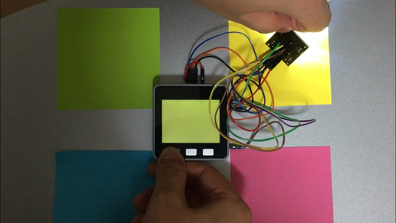

+++
# Date this page was created.
date = 2018-11-24

# Project title.
title = "M5Stackによるカラーピッカー・カラーミキサー"

# Project summary to display on homepage.
summary = "カラーセンサを用いて現実世界の色を読み取り、M5Stackに表示します。また複数の色を読み取り、それらの色を混ぜ合わせた結果を表示することも可能です。"

# Tags: can be used for filtering projects.
# Example: `tags = ["machine-learning", "deep-learning"]`
tags = ["M5Stack","カラーセンサ","IoT"]

image_preview = "projects/colorSensor.png"

+++

## 概要

- 開発言語　　　　　　：Arduino言語
- ハードウェア　　　　：M5Stack，カラーセンサ

## 内容
カラーセンサを用いて現実世界の色を読み取り、M5Stackに表示します。また複数の色を読み取り、それらの色を混ぜ合わせた結果を表示することも可能です。

## 動作

カラーピッカー
<blockquote class="twitter-tweet" data-lang="ja">
カラーセンサーが届いたのでM5Stackでカラーピッカーを作りました。ボタンを押すことで色を読み取ります。<a href="https://twitter.com/hashtag/M5Stack?src=hash&amp;ref_src=twsrc%5Etfw">#M5Stack</a> <a href="https://t.co/a6S67sOUuy">pic.twitter.com/a6S67sOUuy</a>
&mdash; クラクス (@kuracux) <a href="https://twitter.com/kuracux/status/1039846044148723713?ref_src=twsrc%5Etfw">2018年9月12日</a></blockquote>

カラーミキサー
<blockquote class="twitter-tweet" data-lang="ja">
カラーセンサーで検出した2つの色を混ぜた結果をM5Stackにて表示してみました<a href="https://twitter.com/hashtag/M5Stack?src=hash&amp;ref_src=twsrc%5Etfw">#M5Stack</a> <a href="https://t.co/PGdVMADs49">pic.twitter.com/PGdVMADs49</a>
&mdash; クラクス (@kuracux) <a href="https://twitter.com/kuracux/status/1040223757397159937?ref_src=twsrc%5Etfw">2018年9月13日</a></blockquote>

## 紹介記事
M5Stackとカラーセンサでカラーピッカーとカラーミキサーを作る - クラクスの記録帳
https://kuracux.hatenablog.jp/entry/2018/10/01/213000
