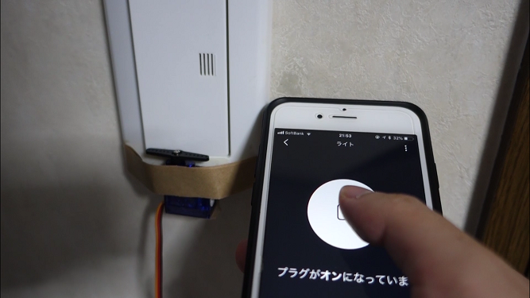

+++
# Date this page was created.
date = 2018-11-23

# Project title.
title = "Amazon EchoとESP32による物理スイッチの制御"

# Project summary to display on homepage.
summary = "スマートスピーカーに話しかけることで物理スイッチのON・OFFを制御します。Alexaアプリから制御することも可能です。"

# Tags: can be used for filtering projects.
# Example: `tags = ["machine-learning", "deep-learning"]`
tags = ["AmazonEcho","ESP32","Servo","Arduino言語","IoT","おうちハック"]

image_preview = "projects/controlRoomLight.PNG"

+++

## 概要

- 開発言語　　　　　　：Arduino言語
- ライブラリ　　　　　：fauxmoESP
- ハードウェア　　　　：ESP32 devkit-C，サーボモータ
- スマートスピーカー　：Amazon Echo
- アプリ　　　　　　　：Amazon Alexa

## 内容
スマートスピーカーに話しかけることで物理スイッチのON・OFFを制御します。また、Alexaアプリから制御することも可能です。

## 動作

音声操作およびAlexaアプリからの操作
<blockquote class="twitter-tweet" data-lang="ja">
Alexaのスマートホームのデバイスとして登録したESP32の音声操作版です。 <a href="https://t.co/g3JYOs1E5J">pic.twitter.com/g3JYOs1E5J</a>
&mdash; クラクス (@kuracux) <a href="https://twitter.com/kuracux/status/1043155972561154048?ref_src=twsrc%5Etfw">2018年9月21日</a></blockquote>

## 紹介記事
- ESP32とAmazon Alexaを連携して物理スイッチを制御する - クラクスの記録帳
https://kuracux.hatenablog.jp/entry/2018/09/24/113000

- HomeMadeGrabageさんにて少し取り上げていただきました。
Amazon Echo と 安物 ESP8266 で スマートホーム　―壁スイッチ ON/OFF― | Home Made Garbage
https://homemadegarbage.com/espalexa03
