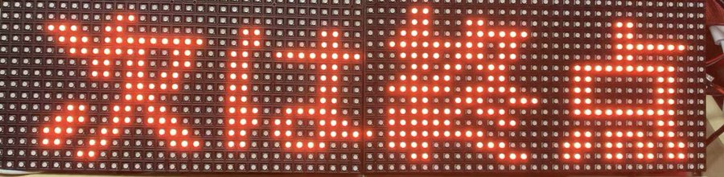

+++
# Date this page was created.
date = 2019-09-14

# Project title.
title = "LEDマトリクスで電光掲示板を作ろう！"

# Project summary to display on homepage.
summary = "16x32のLEDマトリクスパネルを2個使って電光掲示板を作りました"

# Tags: can be used for filtering projects.
# Example: `tags = ["machine-learning", "deep-learning"]`
tags = ["LEDMatrix", "Raspberry_Pi"]

image_preview = "projects/createElectricbulletinboard.jpg"

+++

## 概要

- 開発言語　　　　　　：Python
- ハードウェア　　　　：Raspberry Pi，LEDマトリクスパネル

## 内容
16x32のLEDマトリクスパネルを2個使って電光掲示板を作りました。日本語文字列の横スクロールが可能です。動作方法および接続方法、そして電源ケーブルの整理についてまで記事にて説明しています。

## 動作
<blockquote class="twitter-tweet">
ブックオフなのに本ねぇじゃ〜ん <a href="https://t.co/viFmQBPQTn">pic.twitter.com/viFmQBPQTn</a>
&mdash; クラクス (@kuracux) <a href="https://twitter.com/kuracux/status/1127371692727197696?ref_src=twsrc%5Etfw">May 12, 2019</a></blockquote> 

## 紹介記事
ラズパイとLEDマトリクス(16×32)で電光掲示板を作ってみた - クラクスの記録帳  
https://kuracux.hatenablog.jp/entry/2019/04/28/220523

16×32のLEDマトリクスを2つ繋げて16×64にしてみた - クラクスの記録帳  
https://kuracux.hatenablog.jp/entry/2019/05/19/170719

LEDマトリクスを2枚使ったときの電源ケーブルまわりを整理してみた - クラクスの記録帳  
https://kuracux.hatenablog.jp/entry/2019/05/22/211131
