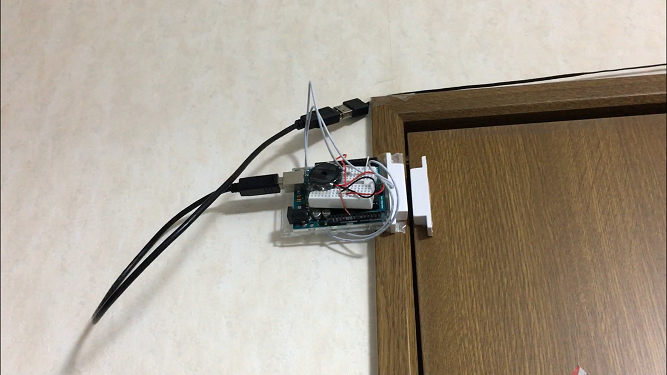

+++
# Date this page was created.
date = 2018-11-23

# Project title.
title = "扉の開閉検出システム"

# Project summary to display on homepage.
summary = "扉の開閉を検出し音楽を流します。"

# Tags: can be used for filtering projects.
# Example: `tags = ["machine-learning", "deep-learning"]`
tags = ["Arduino", "Reed switch", "Arduino言語","IoT","おうちハック"]

image_preview = "projects/detectedDoor.png"

+++

## 概要

- 開発言語　　　　　　：Arduino言語
- ハードウェア　　　　：Arduino Uno，リードスイッチ，圧電スピーカ

## 内容
扉の開閉を検出して圧電スピーカから音楽を鳴らします。検出にはリードスイッチを用いております。

## 動作
<blockquote class="twitter-tweet" data-lang="ja">
Arduinoと圧電スピーカーとリードスイッチを用いた、扉が開いた際に音が鳴る装置です。今回はゼルダの伝説の謎解き音とファミリーマートの入店音です。 <a href="https://t.co/DJuQSShMgB">pic.twitter.com/DJuQSShMgB</a>
&mdash; クラクス (@kuracux) <a href="https://twitter.com/kuracux/status/1031510744754413568?ref_src=twsrc%5Etfw">2018年8月20日</a></blockquote>

