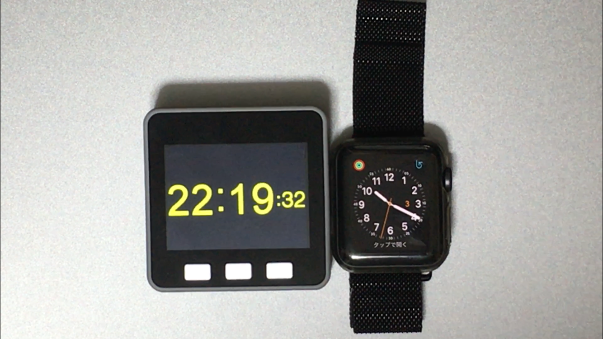

+++
# Date this page was created.
date = 2018-12-09

# Project title.
title = "NTPサーバから時刻を取得してM5Stackに表示"

# Project summary to display on homepage.
summary = "スケッチ例のTFT_Clock_Digitalの時刻をNTPサーバから取得してM5Stackに表示します。"

# Tags: can be used for filtering projects.
# Example: `tags = ["machine-learning", "deep-learning"]`
tags = ["M5Stack","NTP"]

image_preview = "projects/getNTP.PNG"

+++

## 概要

- 開発言語　　　　　　：Arduino言語
- ハードウェア　　　　：M5Stack

## 内容
スケッチ例のTFT_Clock_Digitalの時刻をNTPサーバから取得してM5Stackに表示します。元々のTFT_Clock_Digitalは現在時刻の取得を行っていなかったため、こちらを開発しました。

## 動作
<blockquote class="twitter-tweet" data-lang="ja">
NTPサーバーから取得した時刻をM5StackのTFT_Clock_Digitalで表示してみました <a href="https://t.co/W3zUNAq9F6">pic.twitter.com/W3zUNAq9F6</a>
&mdash; クラクス (@kuracux) <a href="https://twitter.com/kuracux/status/1047478302674280450?ref_src=twsrc%5Etfw">2018年10月3日</a></blockquote>

## 紹介記事
NTPサーバから時刻を取得してM5Stackに表示する - クラクスの記録帳
https://kuracux.hatenablog.jp/entry/2018/10/08/160000
