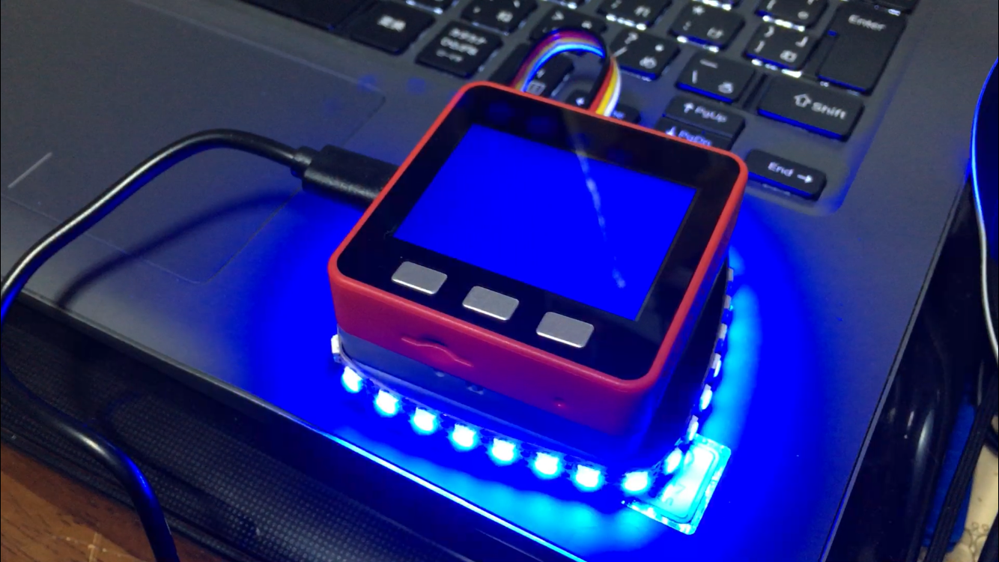

+++
# Date this page was created.
date = 2019-01-04

# Project title.
title = "音に合わせてライトの色変化"

# Project summary to display on homepage.
summary = "気分はパリピ？"

# Tags: can be used for filtering projects.
# Example: `tags = ["machine-learning", "deep-learning"]`
tags = ["M5Stack","マイク"]

image_preview = "projects/loudSoundDetecter.png"

+++

## 概要

- 開発言語　　　　　　：Arduino言語
- ハードウェア　　　　：M5Stack Fire，NeoPixel

## 内容
M5Stack Fire内臓のマイクを利用して大きい音を検出し、ディスプレイの色とNeoPixelのライトの色を変化させます。

## 動作
<blockquote class="twitter-tweet" data-lang="ja">
音量によってライトの色が変わります。音楽に合わせると気分はパリピ。 M5Stack FIREとNeoPixelを使っています。 <a href="https://t.co/nsBlV5be8n">pic.twitter.com/nsBlV5be8n</a>
&mdash; クラクス (@kuracux) <a href="https://twitter.com/kuracux/status/1078667700635725824?ref_src=twsrc%5Etfw">2018年12月28日</a></blockquote>

