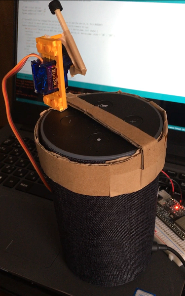

+++
# Date this page was created.
date = 2018-11-23

# Project title.
title = "音声操作によるスマートスピーカーのミュート制御"

# Project summary to display on homepage.
summary = "音声によってスマートスピーカーのミュートボタンを押します。"

# Tags: can be used for filtering projects.
# Example: `tags = ["machine-learning", "deep-learning"]`
tags = ["AmazonEcho","ESP32","Servo","Arduino言語","IoT","おうちハック"]

image_preview = "projects/preview_notRecognizeVoice.png"

+++

## 概要

- 開発言語　　　　　　：Arduino言語
- ライブラリ　　　　　：fauxmoESP
- ハードウェア　　　　：ESP32 devkit-C，サーボモータ
- スマートスピーカー　：Amazon Echo

## 内容
音声入力によってスマートスピーカーのミュートボタンを押します。標準では音声入力によるミュート切り替えが搭載されていなかったため作成しました。

## 動作
<blockquote class="twitter-tweet" data-lang="ja">
Amazon Echoのマイクオフ機能を音声で操作する方法が分からなかったので操作できるようにしました<a href="https://twitter.com/hashtag/AmazonEcho?src=hash&amp;ref_src=twsrc%5Etfw">#AmazonEcho</a> <a href="https://t.co/m4JxJ4rwsY">pic.twitter.com/m4JxJ4rwsY</a>
&mdash; クラクス (@kuracux) <a href="https://twitter.com/kuracux/status/1036131248253546496?ref_src=twsrc%5Etfw">2018年9月2日</a></blockquote>

## 紹介記事
Smartioさんの記事にて取り上げていただきました。

「スマートスピーカーはこう使え！」玄人がやってる究極のスマートライフ
https://smartio.life/news/report/vui-smartlife-ex/
