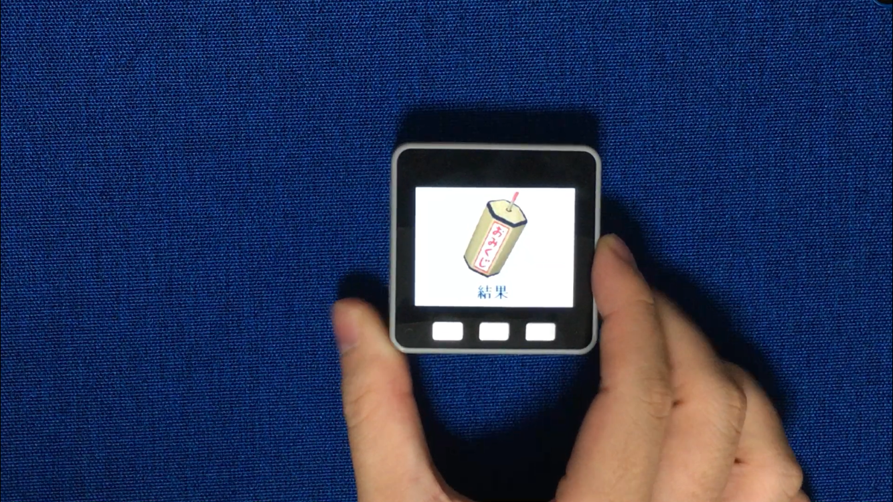

+++
# Date this page was created.
date = 2019-01-04

# Project title.
title = "M5Stackでおみくじ"

# Project summary to display on homepage.
summary = "M5Stack Gray内臓のジャイロセンサを利用して、本体を振ることでおみくじを引けます。"

# Tags: can be used for filtering projects.
# Example: `tags = ["machine-learning", "deep-learning"]`
tags = ["M5Stack","ジャイロセンサ"]

image_preview = "projects/omikuji.png"

+++

## 概要

- 開発言語　　　　　　：Arduino言語
- ハードウェア　　　　：M5Stack Gray，MicroSDカード

## 内容
M5Stack Gray内臓のジャイロセンサを利用して、本体を振ることでおみくじを引くことができます。

こちらのシステムを応用しています。

[M5Stackを振ることによる表示画像の切り替え](../shakem5stack/)

## 動作
<blockquote class="twitter-tweet" data-lang="ja">
あけましておめでとうございます。 新年の運試しをしたいと思い、おみくじを作りました。本体を振ることで結果が変わります。M5Stack Grayを用いて実現しました。 <a href="https://t.co/E434VYYFcH">pic.twitter.com/E434VYYFcH</a>
&mdash; クラクス (@kuracux) <a href="https://twitter.com/kuracux/status/1079767055925108736?ref_src=twsrc%5Etfw">2018年12月31日</a></blockquote>

