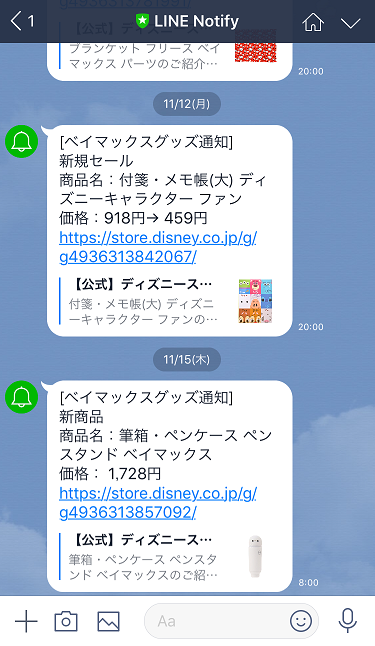

+++
# Date this page was created.
date = 2018-11-22

# Project title.
title = "ベイマックスグッズ通知システム"

# Project summary to display on homepage.
summary = "ベイマックスのグッズが新発売またはセール情報が出た際にLINE Notifyにて通知を送ります。"

# Tags: can be used for filtering projects.
# Example: `tags = ["machine-learning", "deep-learning"]`
tags = ["Ruby", "LINE Notify","Baymax","sqlite3"]

image_preview = "projects/preview_baymax1.png"

+++

## 概要

- 開発言語　　　：Ruby
- ライブラリ　　：Nokogiri，line_notify
- データベース　：sqlite3
- 動作環境　　　：Raspberry Pi3 B+

## 内容
指定した時刻にディズニーストアのベイマックスのページにてスクレイピングを行い、前回取得分のデータとの比較によって、新商品やセール商品を判別。
新商品やセール商品がある場合にはLINE Notifyにて画像のような情報を送ります。

## 動作
<blockquote class="twitter-tweet" data-lang="ja">
ディズニーストアでベイマックスのグッズの新商品やセール品が出た場合にLINEに通知が送られてくるシステムを作りました。新商品が出た際には動画のような通知が来ます(動画の商品は実際は少し前から取り扱われております)<a href="https://twitter.com/hashtag/%E3%83%99%E3%82%A4%E3%83%9E%E3%83%83%E3%82%AF%E3%82%B9?src=hash&amp;ref_src=twsrc%5Etfw">#ベイマックス</a>  <a href="https://twitter.com/hashtag/LINENotify?src=hash&amp;ref_src=twsrc%5Etfw">#LINENotify</a> <a href="https://t.co/sxELK0HWxy">pic.twitter.com/sxELK0HWxy</a>
&mdash; クラクス (@kuracux) <a href="https://twitter.com/kuracux/status/1035653668555476992?ref_src=twsrc%5Etfw">2018年8月31日</a></blockquote>

