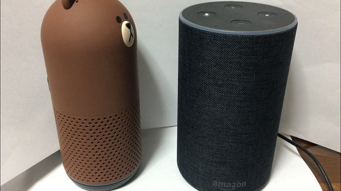

+++
# Date this page was created.
date = 2018-11-24

# Project title.
title = "スマートスピーカー(Clova)からスマートスピーカー(Amazon Echo)に命令"

# Project summary to display on homepage.
summary = "Clovaに聞きたいことを尋ねるとClovaがAmazon Echoに質問してくれます。"

# Tags: can be used for filtering projects.
# Example: `tags = ["machine-learning", "deep-learning"]`
tags = ["AmazonEcho","Clova","Clovaスキル","node.js","スマートスピーカー"]

image_preview = "projects/talkSmartSpeakers.png"

+++

## 概要

- 開発言語　　　　　　：node.js
- スマートスピーカー　：Clova Friends，Amazon Echo

## 内容
スマートスピーカー（Clova Friends）に聞きたいことを尋ねると別のスマートスピーカー(Amazon Echo)に質問してくれます。Clovaスキルの開発によって本システムを実現しております。

## 動作

<blockquote class="twitter-tweet" data-lang="ja">
スマートスピーカーから別のスマートスピーカーにお願いするのをやってみたくなったので、Clova FriendsとAmazon Echoで実現してみました <a href="https://t.co/04yo2FRJOn">pic.twitter.com/04yo2FRJOn</a>
&mdash; クラクス (@kuracux) <a href="https://twitter.com/kuracux/status/1045821811647119360?ref_src=twsrc%5Etfw">2018年9月28日</a></blockquote>

