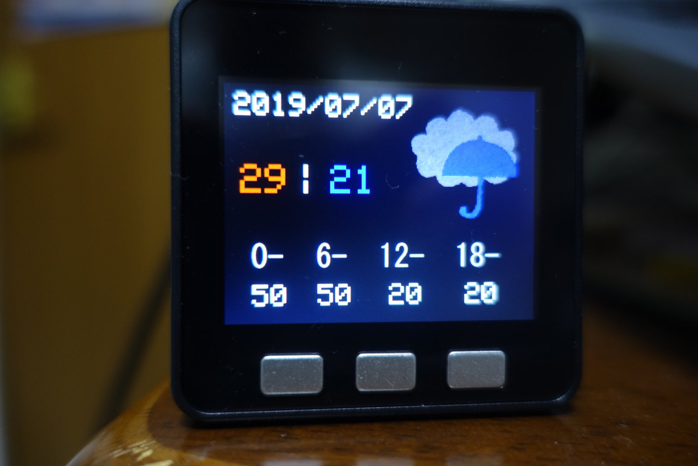

+++
# Date this page was created.
date = 2019-09-15

# Project title.
title = "天気予報をM5Stackで表示してみた"

# Project summary to display on homepage.
summary = "3日分の天気と気温、降水確率を表示できます"

# Tags: can be used for filtering projects.
# Example: `tags = ["machine-learning", "deep-learning"]`
tags = ["M5Stack"]

image_preview = "projects/weatherForecastwithM5Stack.jpg"

+++

## 概要

- 開発言語　　　　　　：Arduino言語
- ハードウェア　　　　：M5Stack Basic，MicroSDカード

## 内容
天気予報の情報として日付や天気、最高気温、最低気温、そして6時間ごとの降水確率が表示されます。また、3つのボタンを左から今日、明日、明後日の天気予報に割り当て、それぞれのボタンを押すことで表示を切り替えます。

## 動作
<blockquote class="twitter-tweet">
天気予報を見る習慣がなさすぎて傘を忘れそうになることが多々あったので、天気予報を表示するガジェットをM5Stackで作りました。 <a href="https://t.co/Bx8FfiPjqe">pic.twitter.com/Bx8FfiPjqe</a>
&mdash; クラクス (@kuracux) <a href="https://twitter.com/kuracux/status/1147666571227066373?ref_src=twsrc%5Etfw">July 7, 2019</a></blockquote> 

## 紹介記事
天気予報をM5Stackで表示してみた - クラクスの記録帳
https://kuracux.hatenablog.jp/entry/2019/07/13/101143
